<h1>Тестовое задание Naumen (Scala)</h1>
<h3>Используемые технологии: sbt, Play 2 framework, Cats Effect, doobie, PostgreSQL</h3>
<h3>Http сервер, предоставляющий REST API для работы с телефонным справочником</h3>

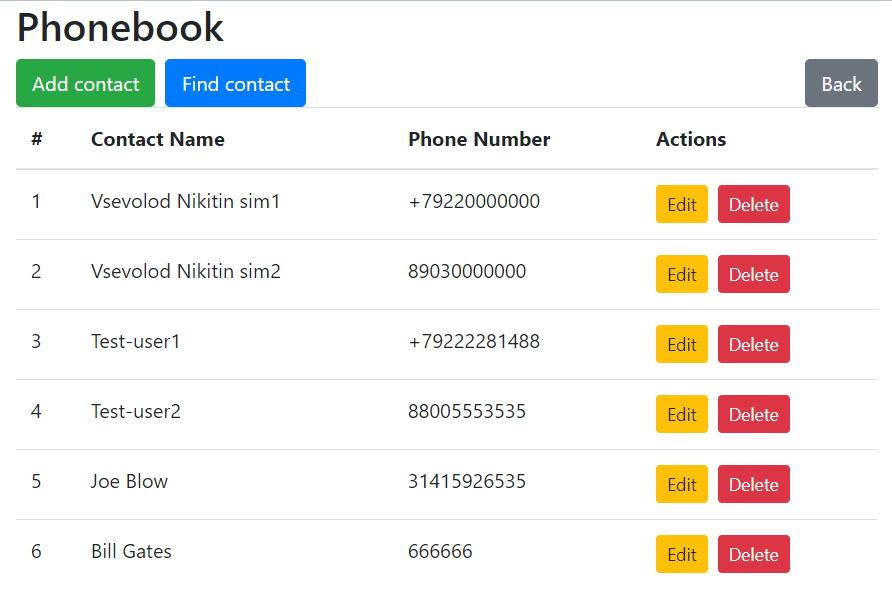
<h2>Использование:</h2>

Клонировать репозиторий:

<code>git clone https://github.com/vsevolod66rus/naumen-test-scala.git</code>

в директории проекта через консоль запустить sbt и проект:

<code>sbt run</code>

(Опционально) По дефолту для работы с бд используется heroku-postgresql, чтобы использовать бд локально нужно поменять в conf/application.conf значения default.driver, default.url, default.user, default.password:

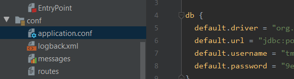

Для тестирования функционала можно использовать API, приведенное ниже, а также клиентское веб-приложение:

[https://github.com/vsevolod66rus/naumen-test-frontend](https://github.com/vsevolod66rus/naumen-test-frontend)
<h2>Функционал:</h2>
<ul>
<li>добавить телефон (строка) и имя (строка) в справочник</li>
<li>получить список ранее добавленных вхождений в справочник в виде json</li>
<li>изменить значения телефона или имени во вхождении выбранному по id</li>
<li>удалить из справочника вхождение по id</li>
<li>поиск всех вхождений по подстроке имени</li>
<li>поиск всех вхождений по подстроке номера</li>
<li>сохранить все данные справочника на диск в виде json файла</li>
</ul>
<h2>Особенности реализации:</h2>
<ul>
<li>асинхронная обработка событий</li>
<li>хранение данных в реляцинной бд</li>
<li>отдельная реализация клиентского приложения на React (ссылка на репозиторий приведена выше)</li>
<li>Compile Time Dependency Injection</li>
<li>Отдельная реализация CORS фильтра и Logging фильра для логов:</li>
</ul>

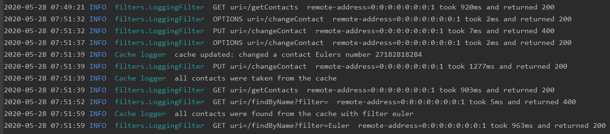

<ul>
<li>scheduler на автоматическое удаления вхождения через
1 год после его внесения в справочник контактов</li>
<li>кэширование запрашиваемых из БД данных в памяти приложения с использованием ConcurrentHashMap - дает выигрыш в скорости обработки запросов, например:</li>
</ul>

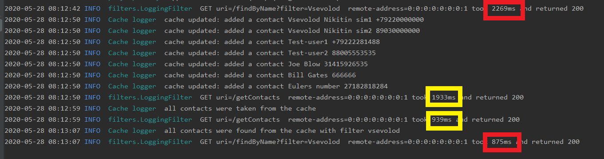
<ul>
<li>валидация на добавление записей в бд</li>
</ul>
<h3>Сценарии использования приведены ниже</h3>
<h2>API</h2>
<h3>POST /addContactJson</h3>

Добавить телефон (строка) и имя (строка) в справочник
 

request url:<code>http://localhost:9090/addContactJson</code>

data: в теле запроса json вида
<pre><code>{
    "name": "Mikro Credit",
    "phoneNumber": "8-800-555-35-35"
}
</code></pre>

response: text <code>"Contact Mikro Credit was added successfully"</code> 
 , либо текст сообщения об ошибке - в зависимости от ошибки

 <h3>POST /addContact</h3>
 
Добавить телефон (строка) и имя (строка) в справочник
 
 
request url:<code>http://localhost:9090/addContact</code>

 
data: в виде application/x-www-form-urlencoded, например 

 
 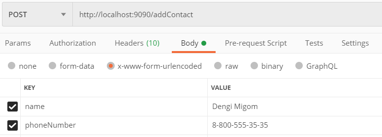
 
response: text <code>"Contact Dengi Migom was added successfully"</code> 
  , либо текст сообщения об ошибке - в зависимости от ошибки

<h3>GET /getContacts</h3>

Получить список актуальных вхождений в справочник

request url:<code>http://localhost:9090/getContacts</code>

response: json вида: 
<pre><code>[
    {
        "id": 1,
        "name": "Vsevolod Nikitin sim1",
        "phoneNumber": "+79220000000"
    },
    {
        "id": 2,
        "name": "Vsevolod Nikitin sim2",
        "phoneNumber": "89030000000"
    },
    {
        "id": 3,
        "name": "Test-user1",
        "phoneNumber": "+79222281488"
    },
    {
        "id": 4,
        "name": "Test-user2",
        "phoneNumber": "88005553535"
    },
    {
        "id": 5,
        "name": "Eulers number",
        "phoneNumber": "27182818284"
    }
]
</code></pre>

<h3>PUT /changeContactJson</h3>

изменить значения телефона или имени во вхождении, выбранному по id
 

request url:<code>http://localhost:9090/changeContactJson</code>

data: в теле запроса json вида

<pre><code>{
    "id": 4,
    "name": "Dengi migom",
    "phoneNumber": "88005553535"
}
</code></pre>

response: text <code>"Contact Dengi Migom was changed successfully"</code> 
 , либо текст сообщения об ошибке - в зависимости от ошибки

 <h3>PUT /changeContact</h3>
 
изменить значения телефона или имени во вхождении, выбранному по id
 
 
request url:<code>http://localhost:9090/changeContact</code>

 
data: в виде application/x-www-form-urlencoded, например 

 
 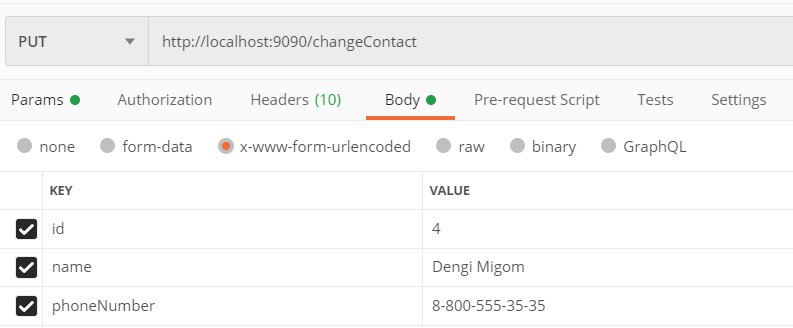
 
response: text <code>"Contact Dengi Migom was changed successfully"</code> 
  , либо текст сообщения об ошибке - в зависимости от ошибки

  
  <h3>DELETE /deleteContact?id=</h3>
  
Удалить из справочника вхождение по id

  
request url: <code>http://localhost:9090/deleteContact?id=3</code>

  
Response: text <code>s"Contact was deleted successfully"</code> 
  , либо текст сообщения об ошибке - в зависимости от ошибки

<h3>GET /findByName?filter=</h3>

Поиск всех вхождений по подстроке имени

request url: <code>localhost:9090/findByName?filter=vsev</code>

response: json вида:

<pre><code>[
    {
        "id": 1,
        "name": "Vsevolod Nikitin sim1",
        "phoneNumber": "+79220000000"
    },
    {
        "id": 2,
        "name": "Vsevolod Nikitin sim2",
        "phoneNumber": "89030000000"
    }
]
</code></pre>

<h3>GET /findByPhone?filter=</h3>

Поиск всех вхождений по подстроке номера
 

request url: <code>localhost:9090/findByPhone?filter=922</code>

response: json вида:

<pre><code>[
    {
        "id": 1,
        "name": "Vsevolod Nikitin sim1",
        "phoneNumber": "+79220000000"
    }
]
</code></pre>
 
<h3>OPTIONS /?path=</h3>

OPTIONS запрос

request url: <code>http://localhost:9090?path</code>

response status: <code>200</code>

<h3>POST /saveDbData</h3>

сохранение всех данных справочника в json файле в директории проекта
 

request url: <code>http://localhost:9090/saveDbData</code>

response: text <code>"db data was saved on disk"</code> 
, либо текст сообщения об ошибке - в зависимости от ошибки

<h2>Роуты</h2>
 
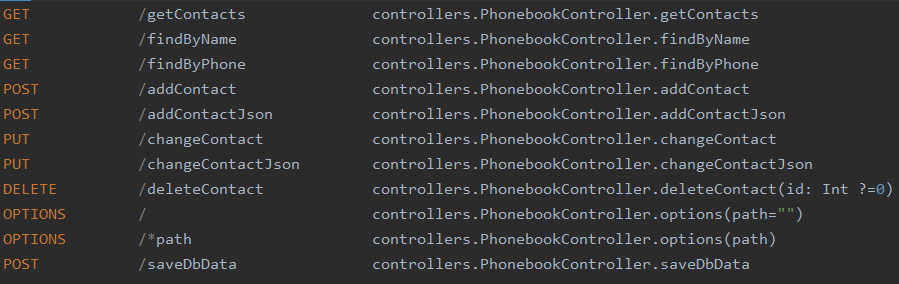
 
<h2>Сценарии использования</h2> 

<h3>Модальное окно добавления контакта:</h3>
 
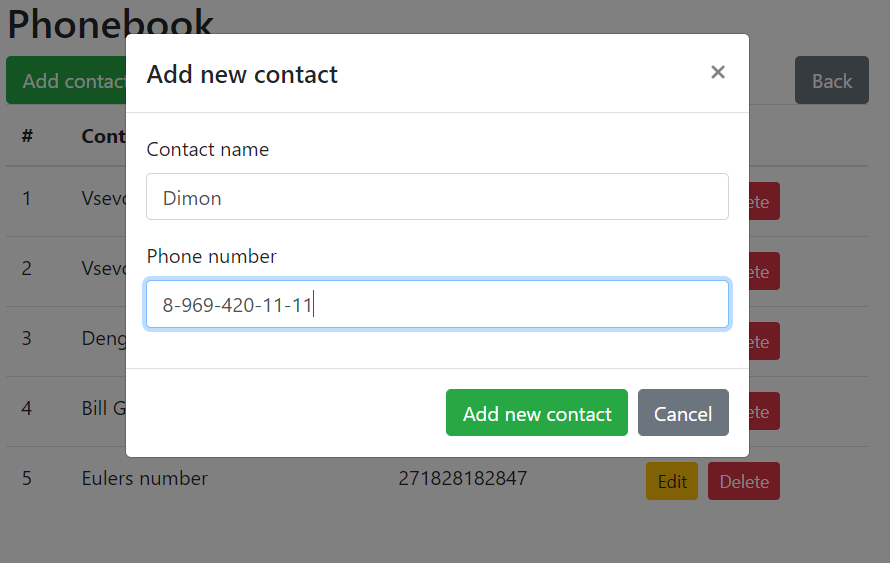

<h3>Модальное окно редактирования контакта:</h3>
 
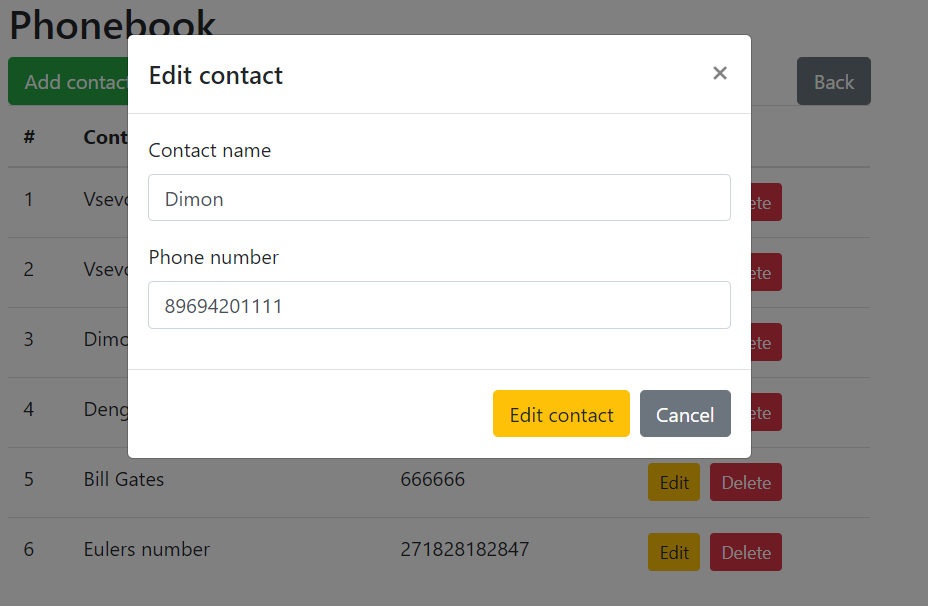 

<h3>Сообщение об ошибке при прохождении валидации:</h3>
 
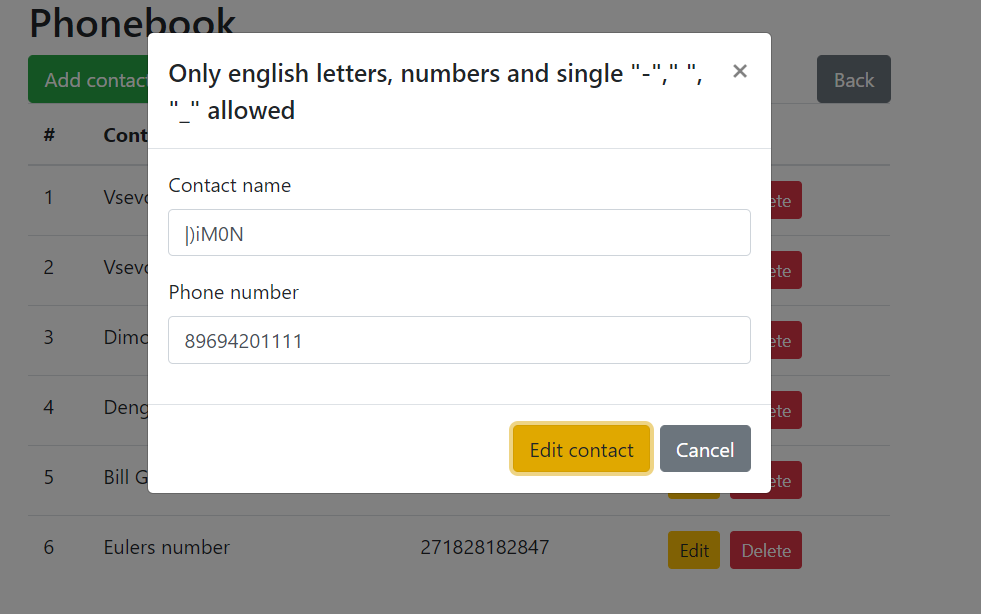 

<h3>Модальное окно поиска контактов:</h3>
 
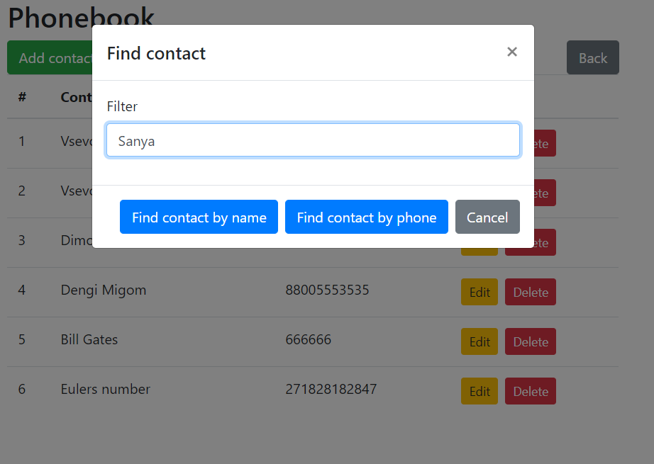

<h3>Сообщение в случае, когда в книге нет контактов по заданному фильтру:</h3>
 
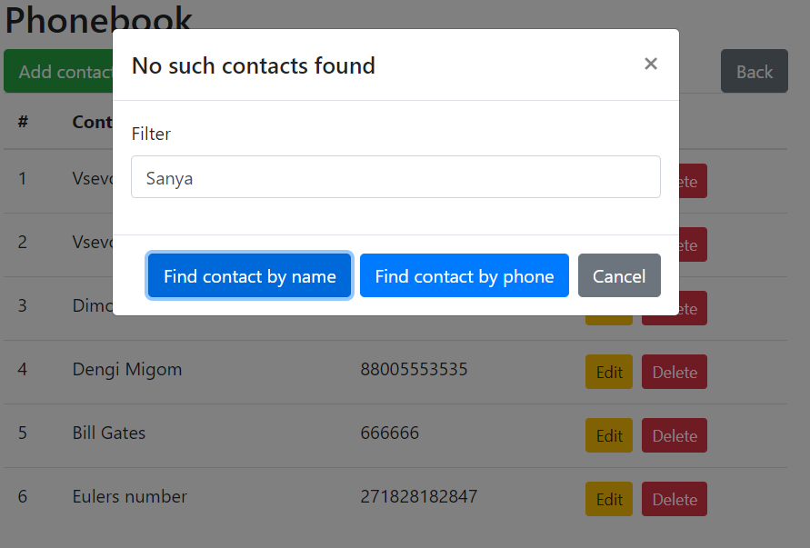

<h3>Модальное окно удаления контакта из справочника:</h3>
 
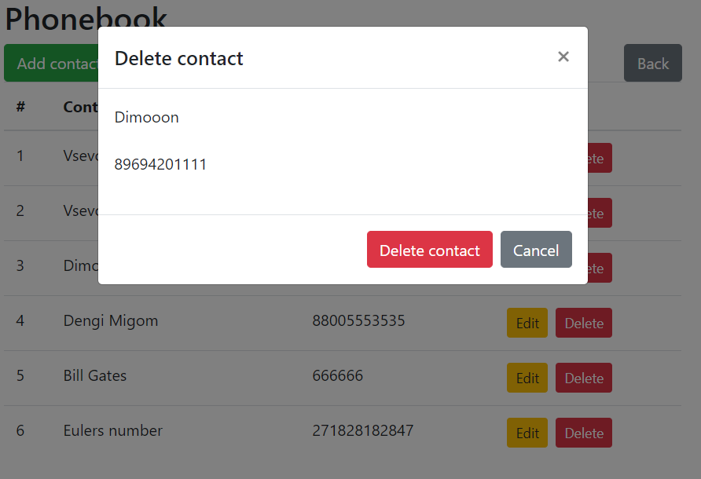  